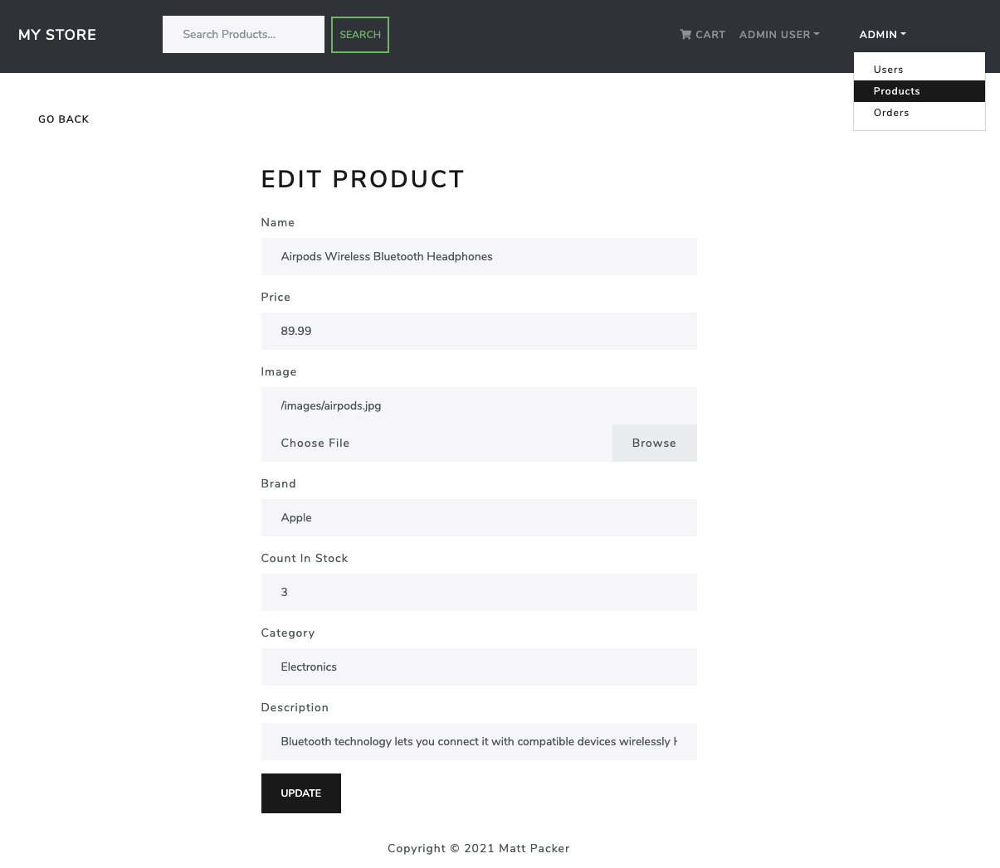

# *My Store* - by Matt Packer
a MERN Stack E-Commerce App

*My Store* is a full featured e-commerce platform built from scratch using the 'MERN' (MongoDB, Express.js, React.js, Node.js) stack.

This app was built as part of an alumni sprint challenge organized by [General Assembly](https://www.generalassemb.ly)'s graduate support team. This app was programmed over the course of a week and followed a fantastic [tutorial](https://www.udemy.com/course/mern-ecommerce/) by Brad Traversy.

For me, the intent of building this application was to continue to level up my developer skill set by getting more practice with the MERN stack, and React Hooks in particular. This project also marked the first time that I used Redux to help manage global state, which I found to be an invaluable tool that I'll seek to utilize in future projects.

This e-commerce application is packed with a ton of fantastic features, including:
* Full Featured Shopping Cart/Check Out Process
* Product Reviews and Ratings
* Administrator Tools: Product Management, User Management, Order Management
* PayPal API Integration for PayPal and Credit Card Payments
* Top Products Carousel
* Product Search
* Product Pagination
* User Profiles and Orders

### Getting Started:
The app can be launched [here](https://mp-mern-ecomm.herokuapp.com/) and was deployed using Heroku.

### Screenshots:

##### Home Page

##### Product Details

##### Shopping Cart

##### Checkout

##### PayPal Payment

##### Admin Product Edit

### Technologies Used:
* React.js with Functional Components and Hooks
* Node.js
* Express.js
* MongoDB
* Mongoose
* React Router
* React-Bootstrap
* Redux
* JWT Authentication
* PayPal API
* Heroku

### Additional Resources:
* [MERN Stack E-Commerce Tutorial](https://www.udemy.com/course/mern-ecommerce/) by Brad Traversy
* Font Awesome

### Next Steps (Icebox Features):
* Customize and enhance app styling, and layouts on most views using CSS and React-Bootstrap.
* Improve accessibility by optimizing colors, fonts, and layouts.
* Add media queries and fully-responsive layout for an optimized experience on mobile, and large displays.
